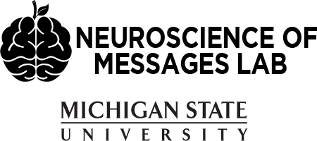
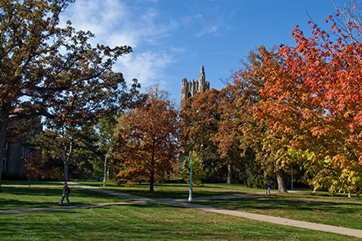

<b>NOM</b>  is a research team in the Department of Communication, College of Communication Arts & Sciences at Michigan State University led by <a href="http://allisoneden.wordpress.com">Allison Eden</a>, <a href="http://www.darmeshi.com">Dar Meshi</a> and <a href="http://www.ralfschmaelzle.net">Ralf Schmaelzle</a>.  

Our research examines neural responses to communicative messages, including pro-health messages, entertainment and social media, and various other spoken, written, or mediated messages. This approach strives to integrate communication science with neuroscience in order to understand how messages are processed by the brain, the biological organ of communication. 

 One of our major roles is to provide a unique interdisciplinary learning environment for communication scientists who seek to embrace neuroscience or biological approaches more broadly. We do our best to help all members pursue the next step in their career ... be it in communication science, communication arts, or elsewhere.

Our main research tools include functional Magnetic Resonance Imaging (fMRI), electroencephalography (EEG/ERP), and related imaging methods. We combine these methods with self-report and linguistic measures, and behavioral testing.   

  

