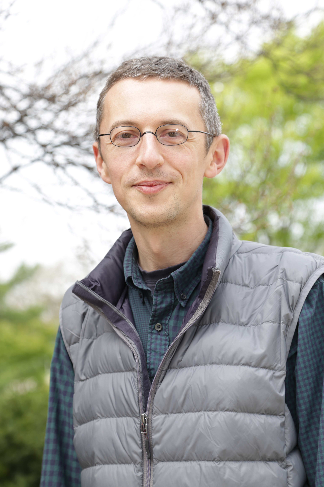
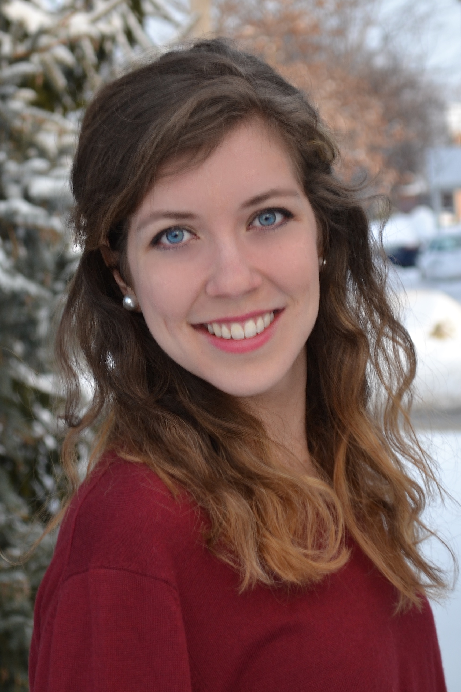
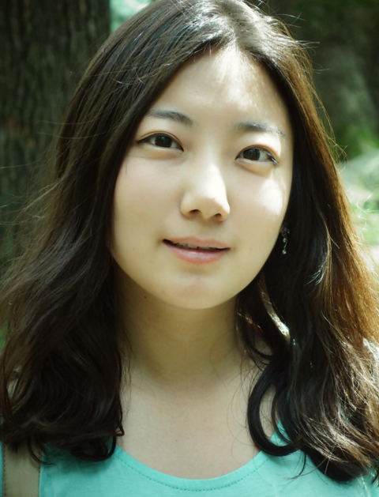
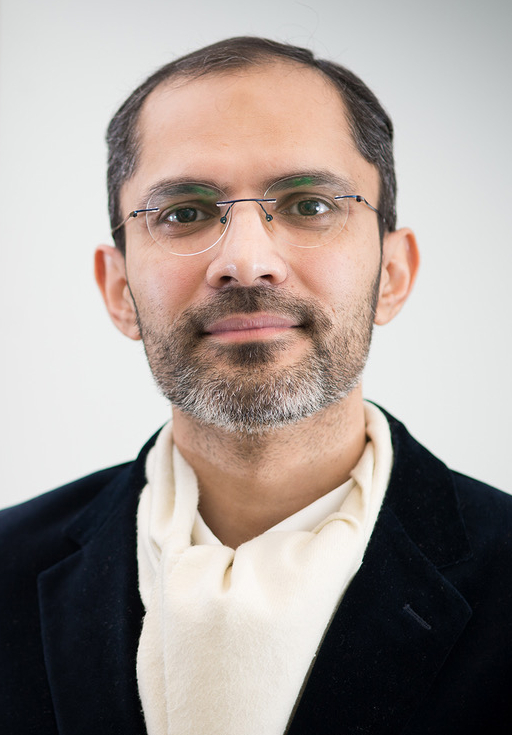

<b>Principal Investigators</b>
 
 

<a href="http://www.ralfschmaelzle.net" target="_blank">Ralf Schmaelzle, Ph.D., Assistant Professor </a> 
 
 
<a href="/people/pdfs/CV_RalfSchmaelzle_Feb2017.pdf">CV</a> | <a href="https://scholar.google.com/citations?user=3VOu6oIAAAAJ&hl=en">Google Scholar</a> | <a href="https://github.com/rschmaelzle/">Github</a> | <a href="https://twitter.com/ralfschmaelzle/">Twitter</a>
  
  
  
  

<a href="http://www.darmeshi.com" target="_blank">Dar Meshi Ph.D., Assistant Professor </a> 
 
 
<a href="https://scholar.google.com/citations?user=ZDiftAQAAAAJ&hl=en">Google Scholar</a> | <a href="https://twitter.com/darmeshi/">Twitter</a>
  
  
  
  

<a href="http://allisoneden.wordpress.com" target="_blank">Allison Eden, Ph.D., Assistant Professor </a> 
 
 
<a href="/people/pdfs/CV_Allison_Eden_Feb2017.pdf">CV</a> | <a href="https://scholar.google.com/citations?user=iU_0LpgAAAAJ&hl=en">Google Scholar</a> | <a href="https://twitter.com/allison_eden/">Twitter</a>
  
  
  
  
<b>Team Members</b>
 
 

Clare Grall, M.A., Ph.D. student 
Research Assistant - Head of Operations
 
 
<a href="/people/pdfs/CV_Clare_Grall_Feb2017.pdf">CV</a> | <a href="https://twitter.com/claregrall">Twitter</a>
  
  
  
  

Joomi Lee, M.A., Ph.D. student
 
 
|
  
  
  
  
Ali Hussain, B.A., M.A., Ph.D. student
 
 
<a href="/people/pdfs/AliHussain_Bio_2017.pdf">Bio</a> | <a href="https://twitter.com/alihussain79">Twitter</a>
  
  
  
  
  
Kevin Kryston, Ph.D. student
 
 
<a href="/people/pdfs/KevinKryston.pdf">Bio</a>
  
  
  
  
<b>Alumni</b>
 
 
Yi Yan  
Master, Communication
SS 2017, Independent Study, "Social" brain network visualization in Python. 
  
David Sherwood  
Undergraduate, Linguistics
SS 2017, Independent Study, Linguistic Analysis of Narratives in Python
  
Nolan Jahn  
Undergraduate, Neuroscience
SS 2017, Independent Study, Brain Segmentation, 3d Printing, & Virtual Reality Brain Modeling

 

