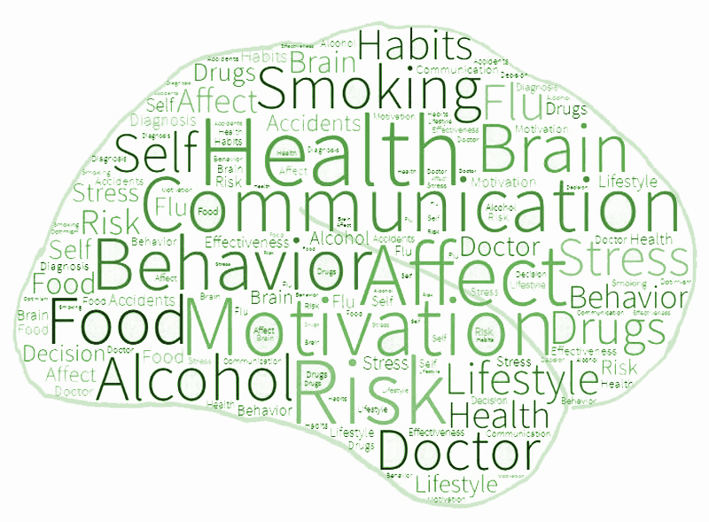
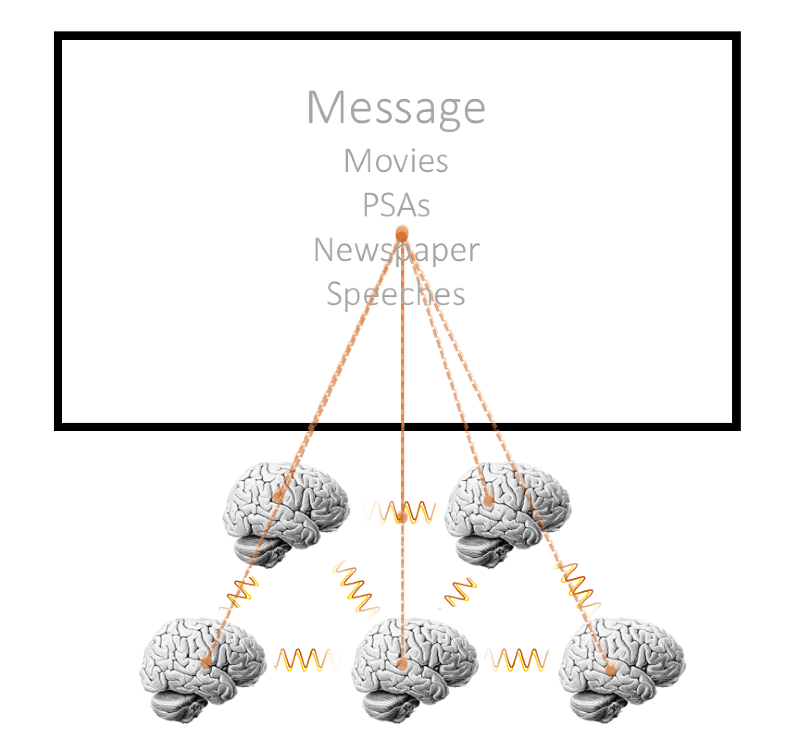

The brain is both sender and receiver of messages. In other words, the brain is the biological organ of communication. As such, our goal is to study how the brain enables communication by following the message under the skin and capturing the responses they evoke. Currently, most of our work focuses on two main topics: the neural processing of health/risk communication and responses during entertainment/media.  

<b>Health and Risk Communication</b> 

Communicating about health risks is important because the leading causes of morbidity are preventable (e.g. smoking, malnutrition, alcohol consumption). Informing individuals about health risks and motivating them to adopt healthier lifestyles may thus prevent many diseases. Research within the fields of communication science, psychology, and public health/pro-health marketing has led to numerous insights regarding effective health and risk communication. A neuroscientific perspective offers several advantages to complement these approaches. In particular, neuroscientific measures open up a new window on how health risk messages engage brain regions that are essential for motivational, emotional, and self-relevant processing. 

<b>Media Neuroscience and Entertainment</b> 

Media can strongly affect us. They bind our attention, engage us emotionally, and leave durable traces in our memories. A characteristic feature of mass media, such as television, film, radio, and literature is that the messages are basically the same for everyone. Think for example the last time you visited a cinema: The movie you saw was the same as that of your neighbour. But did your brain respond in the same way as hers or his? If yes, why? If not, why? In our studies we compare the neural responses towards natural media messages to reveal both similarities and differences in responding to media at different levels of the neural hierarchy - from sensory processes (which should be mostly similar across all receivers) to higher-order responses related to memory and emotion (which are more likely to differ between recipients). In addition, we strive to understand how responses to media shape how we select and seek out media to inform and/or entertain ourselves.

